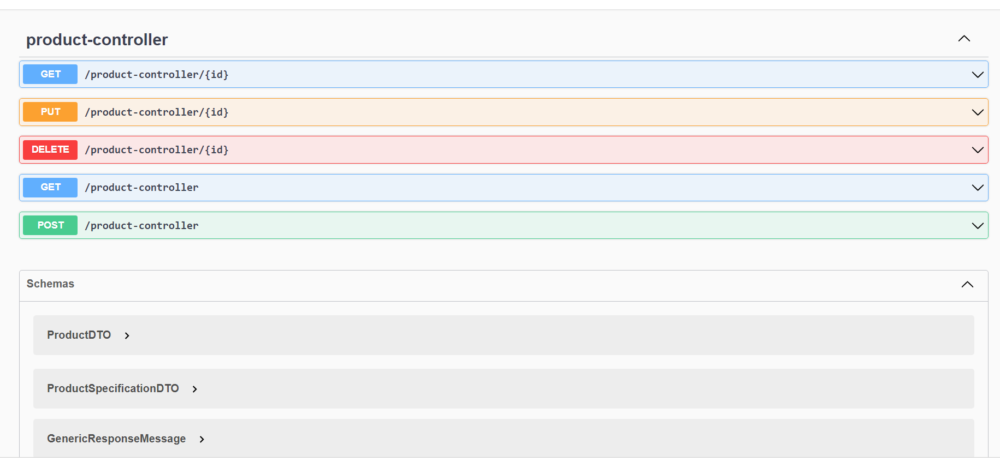
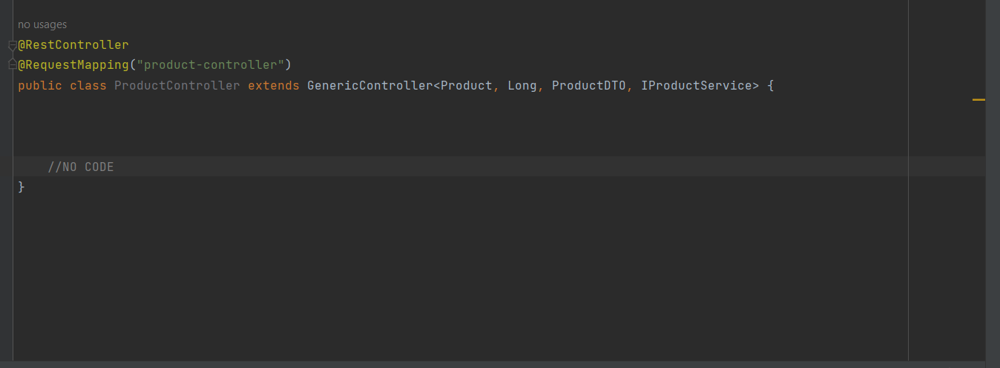
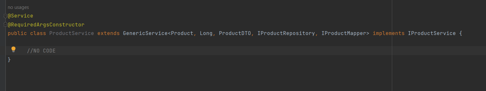

# Generic-Rapid Rest API

---

Swagger

Controller Code 

Service Code

## How to use it

> All generic classes are under generic folder
 
> Product api example classes are under product folder

1) Create an Entity (like Product) extends **GenericEntity**
2) Create a DTO (like ProductDTO) extends **GenericDTO**
3) Create a Mapper (like IProductMapper) extends **IBaseMapper<YourEntity, YourDTO>**
- Add below methods to mapper:
  - YourEntity mapToEntity(YourDTO dto);
  - YourDTO mapToDTO(YourEntity yourEntity);

4) Create a Repository interface (like IProductRepository) extends **IGenericRepository<YourEntity,Long>**
5) Create a Service interface (like IProductService) extends **IGenericService<YourEntity, Long, YourDTO>**
6) Create a Service class (like ProductService) extends **GenericService<YourEntity, Long, YourDTO, YourRepositoryInterface, YourMapper>**
   implements **YourInterface** (like IProductService)
7) Create a Controller class (like ProductController) extends **GenericController<YourEntity, Long, YourDTO, YourServiceInterface>**